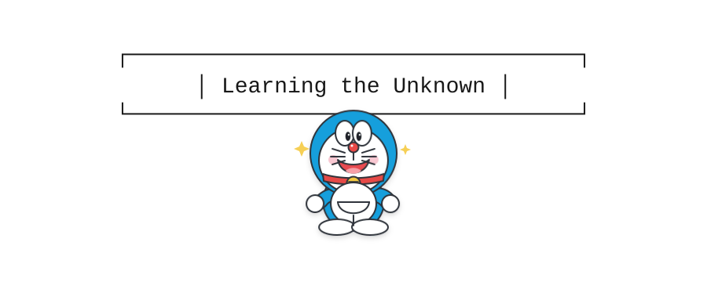

## Hi there 👋

I'm Zhi'ang Cheng.

## 👤 About me

My research focuses on neuroscience, ophthalmology, and other diseases with
substantial genetic components. I investigate the molecular mechanisms
underlying these conditions through integrative multi-omics analyses, spanning
genomics, proteomics, single-cell transcriptomics, spatial transcriptomics,
and metabolomics.

I combine statistical and machine-learning approaches with biological and
clinical knowledge to uncover disease-associated mechanisms, identify
clinically relevant biomarkers, and facilitate the translation of laboratory
discoveries into potential clinical applications.

In addition to computational research, I have hands-on experience in both
in vivo and in vitro studies, including molecular biology techniques, animal
experimentation, and clinical biospecimen processing. This multidisciplinary
background enables me to connect data-driven discoveries with experimental
validation and clinically oriented research.

- 🔭 Research interests: genetic architecture and molecular mechanisms, neurobiology, and single-cell/spatial multi-omics
- 🧬 Methods: biostatistics, statistical genetics, and multi-omics integration
- 💻 Tools: R, Python, Stata, and reproducible data-analysis workflows
- 💬 Communicate with me: genomics, proteomics, multi-omics, and population health

## 💻 Selected projects

1. [STAGE-AD Transformer](https://github.com/zhiangcheng/STAGE-AD-Transformer.git)  
   An integrated framework for evaluating pathogenic or disease-related effects.

2. [Chronic Disease and Cognition](https://github.com/zhiangcheng/chronic_disease_and_cognition)  
   Longitudinal cohort analyses of the association between multimorbidity and cognition.

## 📫 Contact

- ORCID: https://orcid.org/0009-0009-1725-6698
- Personal website: https://bsky.app/profile/charliezhiangcheng.bsky.social
- Email: chengzhiang0306@gmail.com

  

